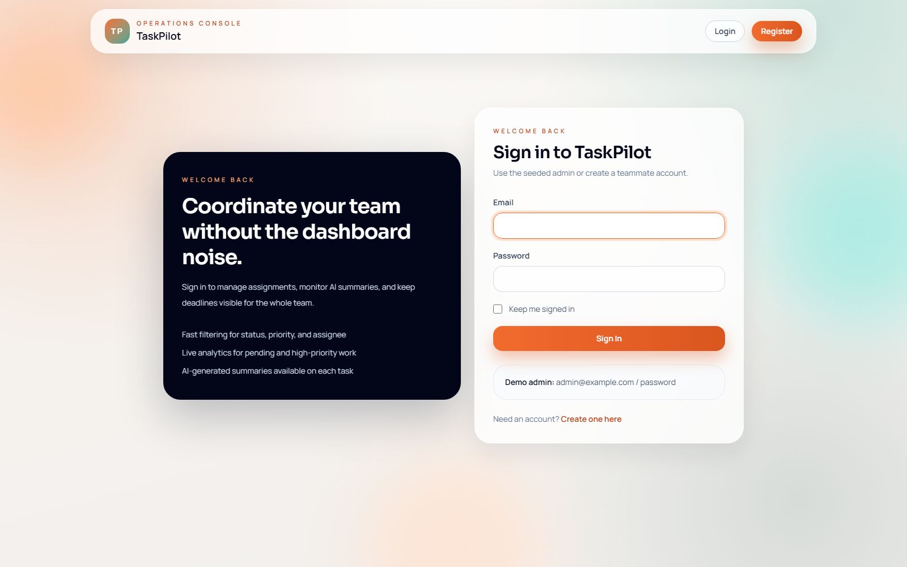
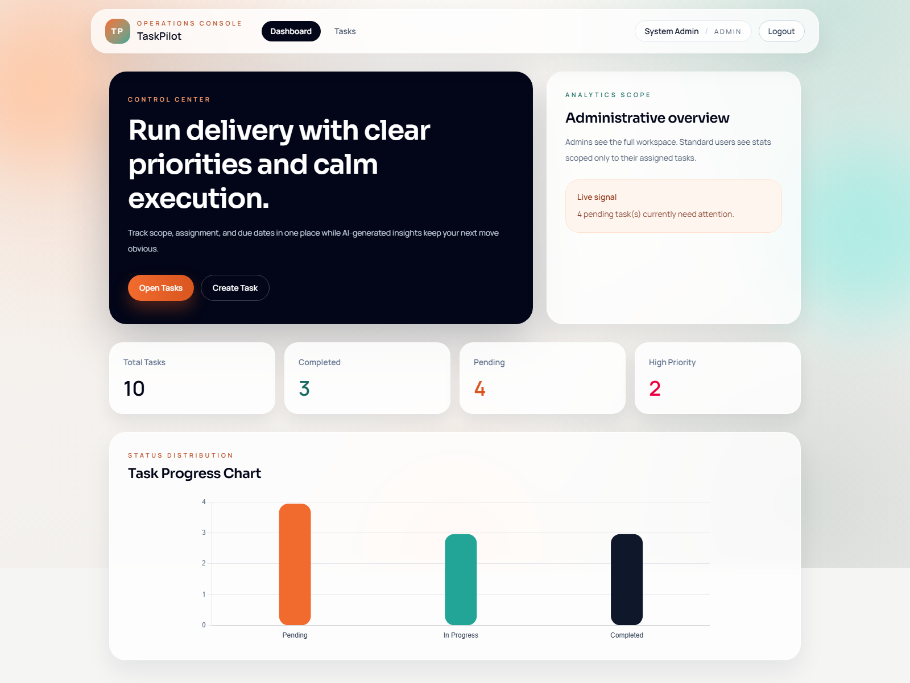
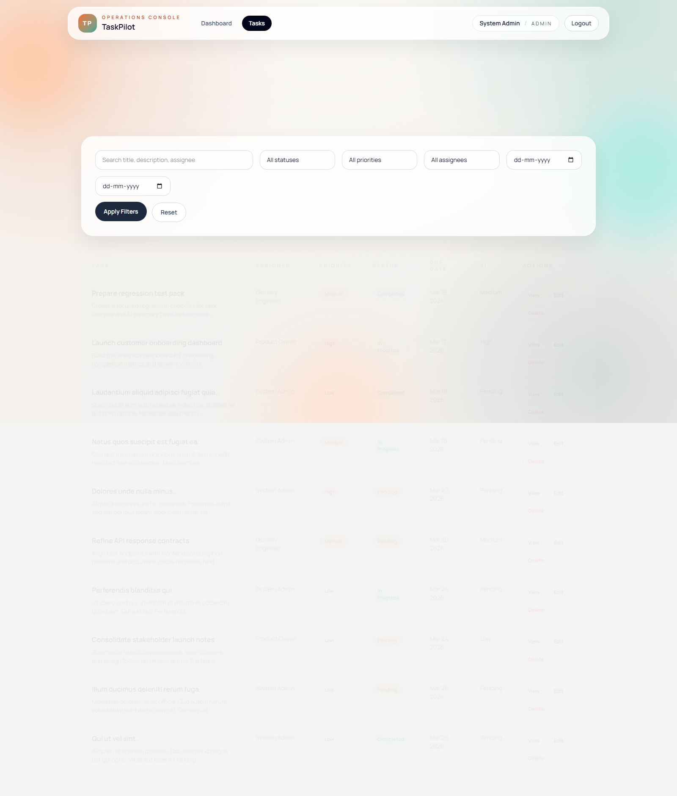
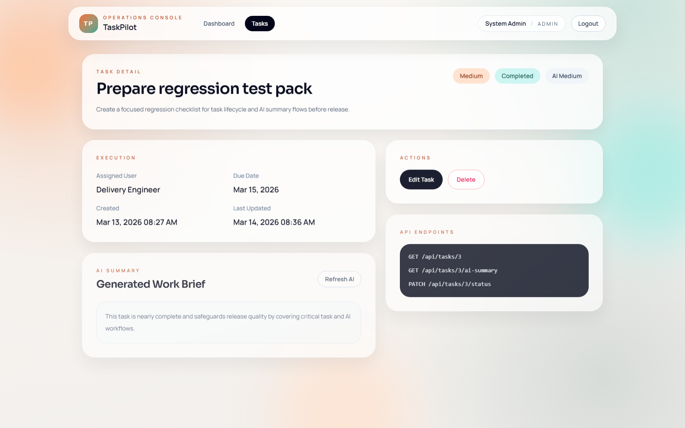

# TaskPilot AI Task Management System

A production-oriented Laravel task management system built with clean architecture, repository pattern, AI-assisted summaries, dashboard analytics, Blade + Tailwind UI, and session authentication.

## Submission Checklist

- Git repository link: <https://github.com/avinash529/task-pilot>
- README (Architecture + AI explanation): see the **Architecture + AI Explanation** section below.
- Screenshots:
  - `docs/screenshots/01-login.png`
  - `docs/screenshots/02-dashboard.png`
  - `docs/screenshots/03-tasks-list.png`
  - `docs/screenshots/04-task-details.png`
- `.env.example`: included at the project root (`.env.example`).

## Stack

- Laravel 12 (compatible with Laravel 10+ requirement)
- PHP 8.2
- MySQL or SQLite
- Blade + Tailwind CSS
- Chart.js
- Queue-ready AI summary pipeline
- Repository pattern with service layer and policies

## Architecture + AI Explanation

Controllers do not talk to Eloquent directly. The request flow is:

`Controller -> FormRequest -> TaskService -> TaskRepositoryInterface -> Eloquent TaskRepository -> Task model`

AI flow:

`TaskService -> AIService -> AIClientInterface -> OpenAI-compatible client`

If AI credentials are missing or `AI_FORCE_MOCK=true`, the app falls back to a deterministic mock summary and predicted priority.

## Auto-Reject Rule Coverage

- No repository layer:
  - Implemented with `TaskRepositoryInterface` + `TaskRepository` and `UserRepositoryInterface` + `UserRepository`.
- Direct model usage in controller:
  - Controllers delegate reads/writes to `TaskService`, which delegates persistence to repositories.
- No AI integration:
  - Implemented with `AIService`, `AIClientInterface`, and `OpenAIClient` via `TaskService`.
- No policies:
  - Implemented with `TaskPolicy` and `UserPolicy`, registered via `Gate::policy(...)`.
- Poor folder structure:
  - Layered structure is organized by responsibility (`Http`, `Services`, `Repositories`, `Policies`, `Jobs`, `Models`, `Requests`, `Resources`).

## Screenshots

### Login


### Dashboard


### Tasks List


### Task Details


## Folder Structure

```text
app/
  Enums/
    TaskPriority.php
    TaskStatus.php
    UserRole.php
  Http/
    Controllers/
      Api/
        TaskApiController.php
      Auth/
        AuthenticatedSessionController.php
        RegisteredUserController.php
      Controller.php
      DashboardController.php
      TaskController.php
    Requests/
      Auth/
        LoginRequest.php
        RegisterRequest.php
      StoreTaskRequest.php
      UpdateTaskRequest.php
      UpdateTaskStatusRequest.php
    Resources/
      TaskResource.php
  Jobs/
    GenerateTaskAiInsightsJob.php
  Models/
    Task.php
    User.php
  Policies/
    TaskPolicy.php
    UserPolicy.php
  Providers/
    AppServiceProvider.php
    RepositoryServiceProvider.php
  Repositories/
    Contracts/
      TaskRepositoryInterface.php
    Eloquent/
      TaskRepository.php
      UserRepository.php
  Services/
    AI/
      OpenAIClient.php
    AIService.php
    TaskService.php
database/
  factories/
    TaskFactory.php
    UserFactory.php
  migrations/
    2026_03_12_221200_add_role_to_users_table.php
    2026_03_12_221300_create_tasks_table.php
  seeders/
    DatabaseSeeder.php
    TaskManagementSeeder.php
resources/
  views/
    auth/
      login.blade.php
      register.blade.php
    dashboard/
      index.blade.php
    layouts/
      app.blade.php
    tasks/
      _form.blade.php
      create.blade.php
      edit.blade.php
      index.blade.php
      show.blade.php
routes/
  api.php
  web.php
```

## Core Features

- Task CRUD for admins
- Standard users can only view tasks assigned to them
- AI-generated task summary and predicted priority
- Dashboard analytics for total, completed, pending, and high-priority tasks
- REST API endpoints under `/api/tasks`
- Repository-level caching via cache versioning
- Queueable AI job for async enrichment
- Feature tests for web and API behavior
- Dockerfile and `docker-compose.yml`

## Roles

- `admin`: full task management access
- `user`: read-only access to assigned tasks

Default seeded accounts:

- `admin@example.com` / `password`
- `owner@example.com` / `password`
- `developer@example.com` / `password`

## API Endpoints

- `GET /api/tasks`
- `POST /api/tasks`
- `GET /api/tasks/{id}`
- `PUT /api/tasks/{id}`
- `DELETE /api/tasks/{id}`
- `PATCH /api/tasks/{id}/status`
- `GET /api/tasks/{id}/ai-summary`

These endpoints use `TaskResource`, form requests, policies, and session-authenticated API access.

## Setup

1. Install dependencies.
2. Copy `.env.example` to `.env`.
3. Configure your database.
4. Generate an app key.
5. Run migrations and seeders.
6. Start Vite and the Laravel server.

Example:

```bash
composer install
cp .env.example .env
php artisan key:generate
php artisan migrate --seed
npm install
npm run dev
php artisan serve
```

## AI Configuration

```env
AI_PROVIDER=mock
AI_BASE_URL=https://api.openai.com/v1
AI_API_KEY=
AI_MODEL=gpt-4.1-mini
AI_QUEUE=false
AI_FORCE_MOCK=true
```

Set `AI_FORCE_MOCK=false` and provide valid credentials to use a real OpenAI-compatible endpoint.

## Queue Support

If you want asynchronous AI enrichment:

```env
AI_QUEUE=true
QUEUE_CONNECTION=database
```

Then run:

```bash
php artisan queue:work
```

## Docker

```bash
docker compose up --build
```

Expose the app through Nginx on `http://localhost:8000`.

## Notes

The official `laravel/breeze` package is included as a dev dependency. The shipped authentication flow is intentionally kept as a custom Blade/session scaffold so the clean-architecture layering stays consistent with the rest of the app instead of relying on generated starter-kit controllers.
